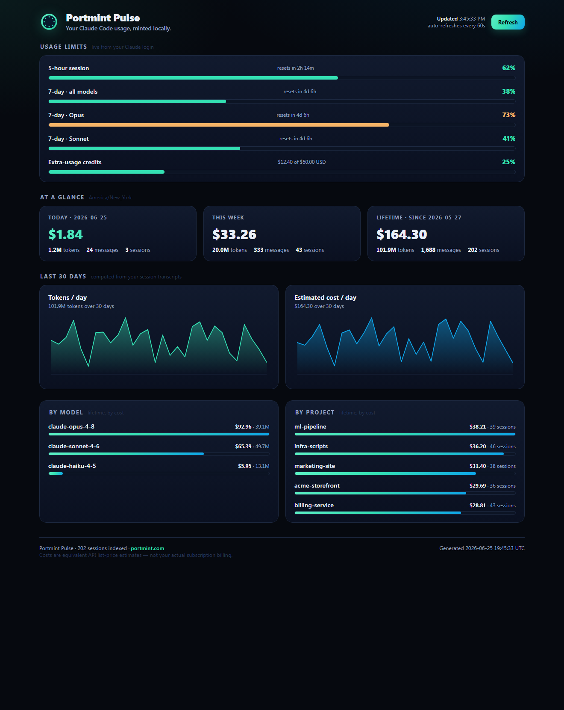

<div align="center">


# Portmint&nbsp;Pulse

**Your Claude Code usage, minted locally.**

A private, local-first dashboard for everything Claude Code is doing on this machine —
live rate-limit windows, daily / weekly / lifetime token & cost, per-model and
per-project breakdowns, and 30-day trend charts.

*Pure Python standard library. No build step. No cloud. No telemetry. Runs on macOS, Windows, and Linux/WSL.*

[](https://github.com/colelevy08/portmint-pulse/actions/workflows/ci.yml)
[](LICENSE)
[](https://www.python.org/downloads/)
[](#install)
[](CONTRIBUTING.md)



</div>

---

## Why this exists

Claude Code records a wealth of usage data on your disk, but gives you no easy way to *see* it.
The popular macOS menubar app [`claude-pulseinator`](https://github.com/mikelane/claude-pulseinator)
visualizes some of it — but it's **macOS-only** (Swift + AppKit + SwiftUI + the macOS Keychain) and
needs a whole **SigNoz + OpenTelemetry** stack for cost history.

**Portmint Pulse** is a from-scratch, cross-platform alternative that computes everything from the
raw data Claude Code already writes locally. No Apple frameworks, no observability stack, no setup:

| | claude-pulseinator (macOS) | **Portmint Pulse** |
|---|---|---|
| Runs on macOS | ✅ | ✅ |
| Runs on **Windows** | ❌ | ✅ |
| Runs on **Linux / WSL** | ❌ (AppKit/SwiftUI) | ✅ |
| Live usage limits | ✅ 3 hardcoded windows | ✅ **every** window the API returns + pay-as-you-go credits |
| Token / cost history | needs **SigNoz + OpenTelemetry** | ✅ computed locally from transcripts — **no setup** |
| Cost estimation | from SigNoz | ✅ local engine, precise per-token-type & per-model pricing |
| Per-**project** breakdown | ❌ | ✅ (by working directory) |
| External services required | SigNoz, Keychain | **none** |
| Dependencies | a Swift toolchain | **the Python standard library** |

---

## Install

Pick whichever you like — all three give you the `portmint-pulse` command (or just run from source).

### With `pipx` (recommended — isolated, always on your PATH)

```bash
pipx install git+https://github.com/colelevy08/portmint-pulse.git
portmint-pulse
```

### With `uv`

```bash
uv tool install git+https://github.com/colelevy08/portmint-pulse.git
portmint-pulse
```

### With `pip`

```bash
pip install git+https://github.com/colelevy08/portmint-pulse.git
portmint-pulse
```

### From source (no install)

```bash
git clone https://github.com/colelevy08/portmint-pulse.git
cd portmint-pulse
python3 app.py
```

Then open **http://localhost:8787** — it auto-opens a tab. **Requirements:** Python 3.9+ and
Claude Code installed & logged in. On Linux/macOS there are *zero* third-party dependencies; on
Windows a small pure-Python `tzdata` is pulled in automatically (only used if you set `--timezone`).

### Options

```bash
portmint-pulse --port 9000                  # use a different port
portmint-pulse --no-browser                 # don't auto-open a tab
portmint-pulse --host 0.0.0.0               # expose on your LAN (default: localhost only)
portmint-pulse --timezone America/New_York  # bucket days in a specific zone (default: your local zone)
portmint-pulse --version
```

### Keep it running

```bash
# Linux / macOS — start it in the background from your shell rc:
( portmint-pulse --no-browser & ) 2>/dev/null
```

---

## What you get

- **Usage limits** — pulled live from your Claude Code login token: the 5-hour session window,
  the 7-day all-models window, per-model 7-day windows, and any pay-as-you-go credit balance.
  Bars go mint → amber → red with reset countdowns.
- **At a glance** — Today / This week / Lifetime cards: estimated cost, tokens, messages, sessions.
- **Last 30 days** — tokens-per-day and cost-per-day area charts (hand-drawn SVG, hover for exact values).
- **By model** — lifetime tokens & cost per Claude model, ranked by spend.
- **By project** — lifetime tokens & cost per working directory, ranked by spend.

Auto-refreshes every 60 seconds; manual **Refresh** button in the header.

---

## Privacy

Pulse is local-first and read-only by design:

- It only ever **reads** files Claude Code already wrote (`~/.claude/projects/**` and your login token).
- The dashboard page makes **zero outbound requests** — no web fonts, no analytics, no CDNs.
- Your token leaves your machine in exactly **one** request: to `api.anthropic.com` for your live
  limits (the same call Claude Code itself makes). Nothing else is sent anywhere. There is no database.
- Binds to `127.0.0.1` (localhost) only, unless you explicitly pass `--host 0.0.0.0`.

---

## Where the data comes from

| Source | Used for |
|---|---|
| `~/.claude/projects/**/*.jsonl` | Token usage, cost, models, projects, history. One JSON-lines file per session; every assistant turn records its model, exact token counts, timestamp, and working directory. |
| `~/.claude/.credentials.json` (Linux/WSL/Windows) **or** the macOS **Keychain** | The OAuth token, used for one HTTPS call to `api.anthropic.com/api/oauth/usage` to fetch your live limit windows. |

Day/week bucketing uses **your machine's local timezone** by default; override with `--timezone`.

### About the cost numbers

The dollar figures are **equivalent API list-price estimates** — what your usage *would* cost at
Anthropic's published per-token API rates. They are **not** your actual subscription billing (a
Claude Max/Pro plan is a flat fee). Treat them as a measure of the *value* you're getting and a
relative gauge across models and projects.

Pricing (per million tokens) lives in one place — `portmint_pulse/pricing.py` — and uses Anthropic's
standard cache multipliers (5-minute cache write = 1.25× input, 1-hour write = 2×, cache read = 0.1×):

| Model | Input | Output |
|---|---|---|
| Opus 4.8 (incl. `[1m]`) | $5 | $25 |
| Opus 4.7 | $5 | $25 |
| Sonnet 4.6 | $3 | $15 |
| Haiku 4.5 | $1 | $5 |
| Fable 5 | $10 | $50 |

A model Pulse doesn't recognize (a brand-new release, or `<synthetic>` local messages) still has its
tokens counted, but is priced at $0 until you add it to `pricing.py`.

---

## Architecture

```
app.py                      # run-from-a-checkout shim → portmint_pulse.cli:main
portmint_pulse/
  cli.py                    # argument parsing, timezone resolution, the startup banner
  pricing.py                # per-token pricing + model-name normalization
  transcripts.py            # parse ~/.claude/projects, incremental mtime cache, aggregate
  usage.py                  # fetch live limit windows (file or macOS Keychain credentials)
  tz.py                     # local-timezone-by-default resolution (Windows-safe)
  server.py                 # stdlib http.server: serves the page + /api/stats JSON
  web/dashboard.html        # the Portmint-branded single-page UI (inline CSS + SVG charts)
tests/                      # offline pytest suite (synthetic fixtures, no real ~/.claude needed)
tools/gen_demo.py           # generate synthetic data + serve (used for the screenshot above)
```

**Flow:** the browser loads `dashboard.html`, which polls `/api/stats`. That handler re-scans your
transcripts (re-reading only files whose modification time changed — basically the active session),
aggregates the cached per-file summaries, fetches the live limits, and returns one JSON snapshot. The
first launch indexes every session up front (≈2s for ~1,800 sessions) so the first page load is instant.

---

## Try it without your own data

```bash
git clone https://github.com/colelevy08/portmint-pulse.git
cd portmint-pulse
python tools/gen_demo.py     # serves a dashboard on fabricated data at http://127.0.0.1:8791
```

---

## How do I debug X?

- **"Limits unavailable / token expired"** — run `claude` once in a terminal to refresh your login,
  then hit Refresh. The OAuth token expires periodically. On macOS the token lives in the Keychain;
  make sure you're logged in to Claude Code.
- **Charts are empty / numbers look low** — check that `~/.claude/projects/` exists and contains
  `.jsonl` files. A fresh Claude Code install simply has little history yet.
- **"Could not start server… port in use"** — something's already on 8787; run with `--port 9000`.
- **A model shows up with $0 cost** — its name isn't in `pricing.py` (a brand-new model, or
  `<synthetic>` local messages). Add it to `_BASE_PER_MTOK`.
- **Windows shows the wrong day boundaries** — pass `--timezone "America/Chicago"` (or your zone).
  Windows has no system timezone database, so named zones need the bundled `tzdata`.

---

## Contributing

PRs and issues are very welcome — see [CONTRIBUTING.md](CONTRIBUTING.md). Run the tests with:

```bash
pip install -e ".[dev]"
pytest
```

## Branding

Built to Portmint's brand standards: the mint porthole mark (`#34e0b3` on Deep Ocean Blue `#07182c`),
Portmint Ink (`#070b14`) surfaces, the mint→sky brand gradient, and Inter throughout. Port + mint. 🛟

## License

[MIT](LICENSE) — do whatever you like with it.

<div align="center"><sub>Made by <a href="https://github.com/colelevy08">Cole Levy</a> · a <a href="https://portmint.com">Portmint</a> open-source project</sub></div>
